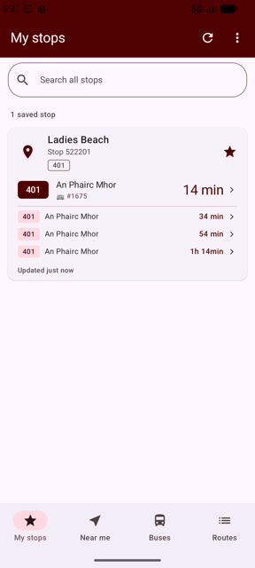
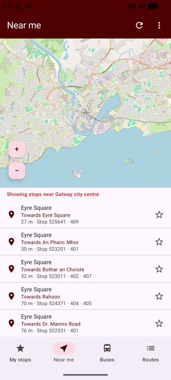
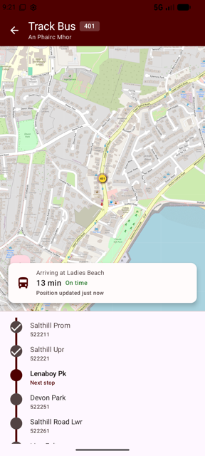
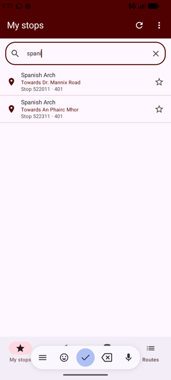
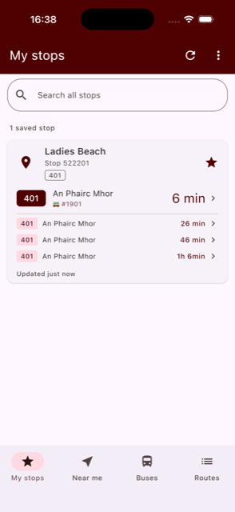
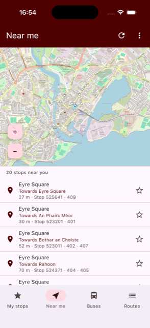
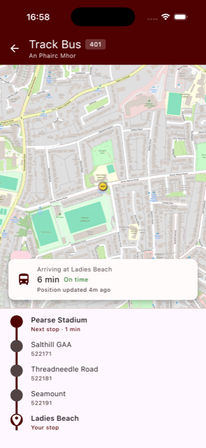
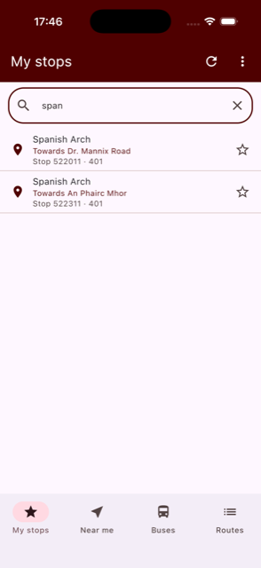

# GalwayBus

GalwayBus shows live bus times for Galway city: real-time departures for your saved stops,
stops near you, live on-map bus tracking with a journey timeline, and network-wide stop search.
A single Compose Multiplatform UI is shared across Android, iOS and Desktop (JVM), backed by a
Ktor service that serves GTFS schedule and GTFS-Realtime data.

## Screenshots

**Android (Jetpack Compose)**

<table>
  <tr>
    <td></td>
    <td></td>
    <td></td>
    <td></td>
  </tr>
  <tr>
    <td align="center">Saved stops</td>
    <td align="center">Near me</td>
    <td align="center">Live tracking</td>
    <td align="center">Stop search</td>
  </tr>
</table>

**iOS (Compose Multiplatform)**

<table>
  <tr>
    <td></td>
    <td></td>
    <td></td>
    <td></td>
  </tr>
  <tr>
    <td align="center">Saved stops</td>
    <td align="center">Near me</td>
    <td align="center">Live tracking</td>
    <td align="center">Stop search</td>
  </tr>
</table>

The same Compose Multiplatform UI also runs on **Desktop (JVM)**.

## Kotlin Multiplatform

This project also acted as an initial platform I used when starting to explore **Kotlin Multiplatform**
capabilities. I also wrote a number of posts about some of my
experiences using **KMP** in the project.

* [SwiftUI meets Kotlin Multiplatform!](https://johnoreilly.dev/2019/06/08/swiftui-meetings-kotlin-multiplatform/)
* [Introduction to Multiplatform Persistence with SQLDelight](https://johnoreilly.dev/posts/sqldelight-multiplatform/)
* [Using Google Maps in a Jetpack Compose app](https://johnoreilly.dev/posts/jetpack-compose-google-maps/)
* [Using Google Maps in a Jetpack Compose app - Part 2!](https://johnoreilly.dev/posts/jetpack-compose-google-maps-part2/)

## Code organisation

* [/iosApp](./iosApp/iosApp) contains an iOS application. Even if you’re sharing your UI with Compose Multiplatform, you
  need this entry point for your iOS app. This is also where you should add SwiftUI code for your project.

* [/shared](./shared/src) is for code that will be shared across your Compose Multiplatform applications. It contains
  several subfolders:
    - [commonMain](./shared/src/commonMain/kotlin) is for code that’s common for all targets.
    - Other folders are for Kotlin code that will be compiled for only the platform indicated in the folder name. For
      example, if you want to use Apple’s CoreCrypto for the iOS part of your Kotlin app,
      the [iosMain](./shared/src/iosMain/kotlin) folder would be the right place for such calls. Similarly, if you want
      to edit the Desktop (JVM) specific part, the [jvmMain](./shared/src/jvmMain/kotlin)
      folder is the appropriate location.

### Running the apps

Use the run configurations provided by the run widget in your IDE's toolbar. You can also use these commands and
options:

- Android app: `./gradlew :androidApp:assembleDebug`
- Desktop app:
    - Hot reload: `./gradlew :desktopApp:hotRun --auto`
    - Standard run: `./gradlew :desktopApp:run`
- iOS app: open the [/iosApp](./iosApp) directory in Xcode and run it from there.

### Running tests

Use the run button in your IDE's editor gutter, or run tests using Gradle tasks:

- Android tests: `./gradlew :shared:testAndroidHostTest`
- Desktop tests: `./gradlew :shared:jvmTest`
- iOS tests: `./gradlew :shared:iosSimulatorArm64Test`

## Full set of Kotlin Multiplatform / Compose / SwiftUI samples

*  PeopleInSpace (https://github.com/joreilly/PeopleInSpace)
*  GalwayBus (https://github.com/joreilly/GalwayBus)
*  Confetti (https://github.com/joreilly/Confetti)
*  BikeShare (https://github.com/joreilly/BikeShare)
*  FantasyPremierLeague (https://github.com/joreilly/FantasyPremierLeague)
*  ClimateTraceKMP (https://github.com/joreilly/ClimateTraceKMP)
*  GeminiKMP (https://github.com/joreilly/GeminiKMP)
*  MortyComposeKMM (https://github.com/joreilly/MortyComposeKMM)
*  StarWars (https://github.com/joreilly/StarWars)
*  WordMasterKMP (https://github.com/joreilly/WordMasterKMP)
*  Chip-8 (https://github.com/joreilly/chip-8)
*  FirebaseAILogicKMPSample (https://github.com/joreilly/FirebaseAILogicKMPSample)
*  OnDeviceAI (https://github.com/joreilly/OnDeviceAI)

